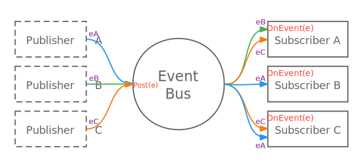

# lipence/eventbus

This package provides _publish & subscribe_ service in go.

Here defines `Event` and `Subscriber` interface, which inspired by java api. Any object that implements the above interface can participate in any bus implementation. Meanwhile, we do not restrict the
form of `Publisher`, which can be any object, or just a statement.



As shown above, The Publisher produce Event and launch it by calling `Post` method on the eventBus, then the bus distributes events by calling `OnEvent` of each subscriber, and subscriber could handle
different events.

You can use eventbus to：

* Decouples complex transaction logic
* Manage program lifecycle
* Build plugins
* ......

## Definition

### `type Key string`

Unique identity for each Event. Subscriber listens to events which hold the same Key.

### `type Priority uint8`

Used to sort the subscribers before triggered: The lower the priority, the sooner subscriber will be triggered.

## Interface

```go
type Event interface {
    Key() Key
}
```

**Event** is produced by Publisher, which holds the unique key for identification and other params (accessible after type assertion). Publisher should launch it by calling `Post` on `Bus`.

```go
type Bus interface {
    Post(Event) error
    PostAndClear(Event) error
    Register(Subscriber) error
    Unregister(Subscriber)
}
```

**Bus** holds associations of events with subscribers. We add/remove association by calling `Register`/`Unregister`, and launch event by calling `Post`. If an event should be called only once, wa
calls `PostAndClear`.

```go
type Subscriber interface {
    Events() map[Key]Priority
    OnEvent(Event) error
}
```

**Subscriber** acts as event handler. The map returned by `Events` declares desired event and its processing priority. `OnEvent` receives and processes any event declared in `Events`.

## Usage

Please refer to files in [example](./example).

## RoadMap

- [x] Hook Mode
- [ ] Filter Mode
- [x] Sync Executor
- [ ] Async Executor
- [ ] Watcher

## Changelog

- v0.1.0 Initial Code

## Contact

Kenta Lee ( [kenta.li@cardinfolink.com](mailto:kenta@cardinfolink.com) )

## License

`lipence/eventbus` source code is available under the Apache-2.0 [License](/LICENSE)
